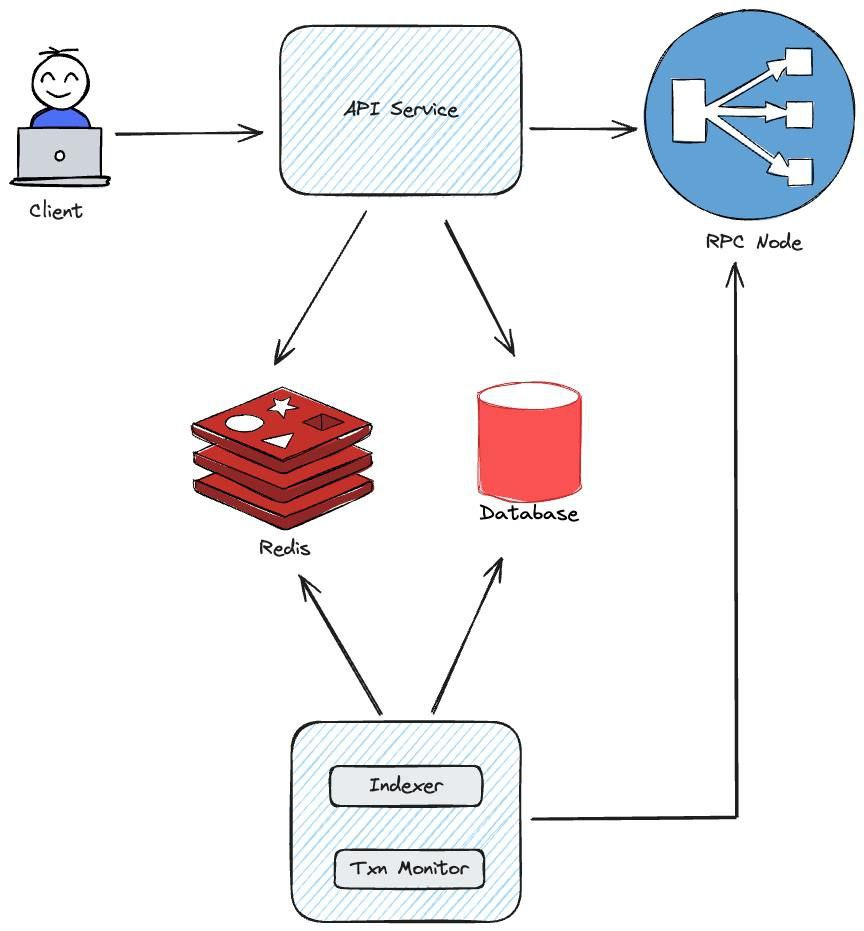

# Libre Investment System Design Doc

## Architecture Overview

---
## 🧱 **Core Components**

### 1. 🧰 **Backend REST API**
- Exposes RESTful endpoints for investment and redemption operations.
- Generates raw Ethereum transactions for clients to sign.
- Verifies and broadcasts signed transactions with retries and error handling.
- Authenticates users using **JWT** and [**SIWE (Sign-In With Ethereum)**](https://docs.login.xyz/).
- Interacts with **PostgreSQL** for persistence and **Redis** for caching.
- Implementation: [`src/api`](src/api/)

---

### 2. ⛓️ **Blockchain Indexer**
- Listens to **FundToken** smart contract events on-chain.
- Decodes and stores:
  - `Investment`
  - `Redemption`
  - `MetricsUpdated`
- Persists data to **PostgreSQL**.
- Caches fund metrics in **Redis**.
- Efficient recovery via block checkpoints.
- Implementation: [`src/indexer`](src/indexer/)

---

### 3. ⏱️ **Transaction Monitor**
- Periodically scans the DB for `PENDING` transactions.
- Fetches receipts from the **Blockchain RPC**.
- Updates status to `SUCCESS` or `FAILED` (after 10 retries).
- Retries and handles missing/in-flight tx scenarios gracefully.
- Implementation: [`src/monitor`](src/monitor/)

---

### 4. 🗃️ **PostgreSQL Database**
- Primary relational database.
- Stores:
  - Fund tokens
  - Transaction records
  - Smart contract events
- Provides durable storage for data.

---

### 5. ⚡ **Redis**
- High-speed in-memory cache layer.
- Stores:
  - Real-time fund metrics
  - Investor token balances
  - Last indexed block per contract
  - Rate limiter states
- Reduces latency and boosts API/indexer performance.

---

### 6. 🔗 **Blockchain RPC**
- Bridge to the blockchain (e.g., Infura, Alchemy).
- Used by:
  - API Server (for tx publishing and gas estimation)
  - Indexer (for log scanning)
  - Monitor (for tx status checks)
- Enables read/write access to smart contracts and events.
   - Provides access to blockchain networks
   - Handles contract interactions

---
## 📦 Data Models

Defined in [`prisma/schema.prisma`](prisma/schema.prisma):

### FundToken
- Represents a fund token contract on a specific chain
- Fields:
  - `id`: Unique identifier
  - `address`: Contract address
  - `chainId`: Blockchain network identifier
  - `createdAt`: Creation timestamp
  - `updatedAt`: Last update timestamp

### Transaction
- Records all blockchain transactions
- Fields:
  - `id`: Unique identifier
  - `investor`: Investor's wallet address
  - `type`: Transaction type (Invest/Redeem)
  - `status`: Transaction status
  - `fund`: Fund token address
  - `chainId`: Blockchain network identifier
  - `hash`: Transaction hash
  - `amount`: Transaction amount
  - `retryCount`: Number of retry attempts
  - `createdAt`: Creation timestamp
  - `updatedAt`: Last update timestamp

### InvestmentEvent
- Records successful investment transactions
- Fields:
  - `id`: Unique identifier
  - `investor`: Investor's wallet address
  - `usdAmount`: Investment amount in USD
  - `sharesIssued`: Number of shares issued
  - `sharePrice`: Price per share
  - `txHash`: Transaction hash
  - `fundAddress`: Fund token address
  - `chainId`: Blockchain network identifier
  - `createdAt`: Creation timestamp

### RedemptionEvent
- Records successful redemption transactions
- Fields:
  - `id`: Unique identifier
  - `investor`: Investor's wallet address
  - `shares`: Number of shares redeemed
  - `usdAmount`: Redemption amount in USD
  - `sharePrice`: Price per share
  - `txHash`: Transaction hash
  - `fundAddress`: Fund token address
  - `chainId`: Blockchain network identifier
  - `createdAt`: Creation timestamp

### MetricsUpdatedEvent
- Records fund metrics updates
- Fields:
  - `id`: Unique identifier
  - `totalAssetValue`: Total value of fund assets
  - `sharesSupply`: Total number of shares
  - `sharePrice`: Current share price
  - `txHash`: Transaction hash
  - `fundAddress`: Fund token address
  - `chainId`: Blockchain network identifier
  - `createdAt`: Creation timestamp
---
## 🔐 Blockchain Interaction Flow (API Design)

1. **Client-side Request (Unsigned Transaction)**
   - The client initiates an investment or redemption by calling the API.
   - The API responds with a raw transaction payload containing encoded call data, gas info, `to`, and `chainId`.
   - [Invest Transaction Implementation](src/api/investment/investment.controller.ts#L14)
   - [Redeem Transaction Implementation](src/api/investment/investment.controller.ts#L29)

2. **Client-side Signing**
   - The client signs the transaction locally using their wallet (e.g., MetaMask).
   - The signed transaction is then sent back to the API.

3. **Backend Transaction Verification**
   - The API unpacks the signed transaction.
   - It verifies:
     - 🔐 `signer` matches the `from` address
     - 🎯 `to` matches the intended fund contract
     - 📦 `data` matches the expected transaction payload
   - [Verification Implementation](src/api/investment/investment.service.ts#L90)

4. **Transaction Publishing & Persistence**
   - Upon successful verification, the backend submits the signed transaction to the blockchain via JSON-RPC.
   - The transaction is recorded in the database with status `PENDING` and stored for monitoring.
   - [Transaction Publishing](src/utils/contract.ts#L113)

5. **Error Handling & Reliability**
   - All RPC-related errors (e.g., `call revert`, `network failure`, `server unavailable`) are handled gracefully.
   - The system uses exponential backoff and retries to ensure reliable delivery.
   - [Error Handling](src/utils/errors.ts)

---
## 🔄 Component Interactions

1. **User → API Server**
   - Submits request to invest/redeem
   - Gets [unsigned tx](src/api/investment/investment.controller.ts#L14), signs on frontend, submits to API
   - API [verifies, publishes tx](src/api/investment/investment.controller.ts#L44) to blockchain, stores pending record in DB

2. **Indexer → Blockchain + DB + Redis**
   - Periodically fetches [logs](src/indexer/processor.ts#L149) for known contracts from Blockchain RPC
   - [Decodes and persists](src/indexer/processor.ts#L8) `Investment`, `Redemption`, `MetricsUpdated` events
   - Updates Redis [cache](src/indexer/processor.ts#121) with latest metrics per fund

3. **Transaction Monitor → Blockchain + DB + Redis**
   - Every minute, checks `Transaction` records with `Pending` status
   - Fetches tx receipt via Blockchain RPC
   - Updates `status` to `Success` or `Failed` (after 10 retries)

4. **API Server → Blockchain + DB + Redis**
   - Publishes transactions to RPC
   - Reads/writes investor and transaction data from DB
   - Caches fund metrics & balances in Redis
